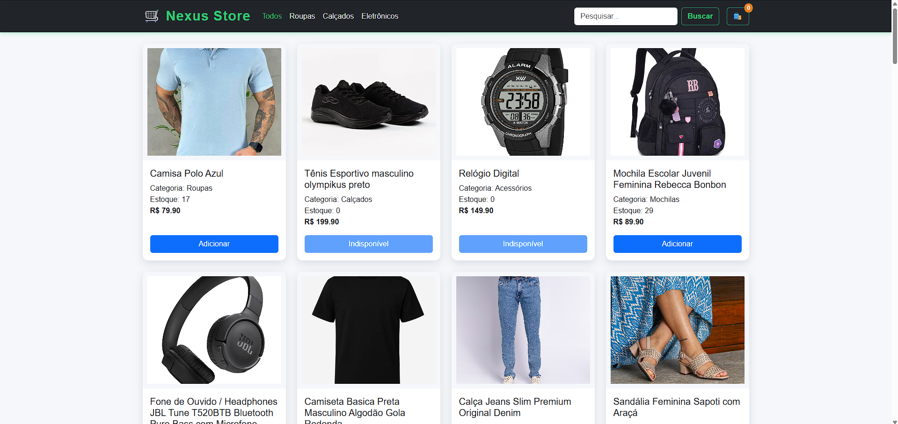
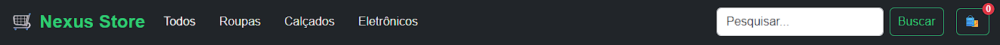
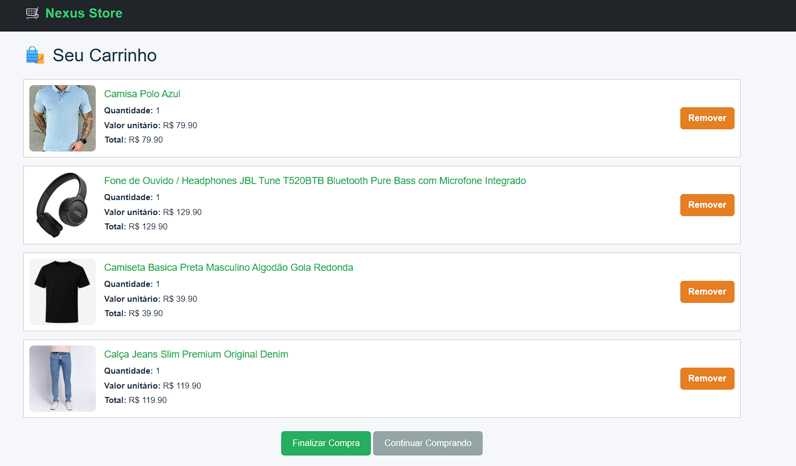

# 🛒 Nexus Store

Uma loja desenvolvida com HTML, CSS, JavaScript e Bootstrap. Este projeto simula um e-commerce, com listagem de produtos, filtro por categoria, busca, carrinho de compras e atualização de estoque usando uma API simulada com `json-server`.

---

## 📌 Descrição

A **Nexus Store** é um projeto de front-end que oferece uma experiência básica de compra online. Ele permite ao usuário:

- Navegar pelos produtos disponíveis;
- Adicionar itens ao carrinho;
- Visualizar e remover itens do carrinho;
- Finalizar a compra;
- Atualizar o estoque com base nos itens comprados.

---

## ✅ Funcionalidades

- 🖼️ Exibição de produtos com imagem, nome, categoria, preço e estoque.
- 🧭 Filtro por categorias: Roupas, Calçados, Eletrônicos.
- 🔍 Busca por nome de produto.
- ➕ Adição de itens ao carrinho com controle de estoque.
- 🗑️ Remoção de itens do carrinho.
- 🛍️ Finalização de compra que atualiza o estoque na API.
- 🧠 Carrinho salvo no `localStorage`.

---

## 🛠️ Tecnologias utilizadas

- HTML5
- CSS3
- JavaScript
- [Bootstrap 5.3](https://getbootstrap.com/)
- [json-server](https://github.com/typicode/json-server) (para simular o backend)

---

## ▶️ Como executar o projeto

### 1. Clone o repositório:

```bash
git clone https://github.com/seu-usuario/nexus-store.git
cd nexus-store
````

### 2. Instale o `json-server` dentro da pasta API (caso ainda não tenha):

```bash
npm install json-server
```

### 3. Inicie o servidor com o arquivo `produtosdb.json`:

```bash
npx json-server produtosdb.json
```

> O arquivo `produtosdb.json` deve conter os dados dos produtos e estar na pasta API do projeto.

### 4. Abra o projeto no navegador

Você pode abrir o `index.html` diretamente ou usar o Live Server no VS Code para facilitar.

---

## 📸 Imagens das telas

### 🏠 Página Inicial (Lista de produtos)



### 🔍 Busca e Filtros



### 🛒 Carrinho




---


Desenvolvido por [Lucas Miguel Vieira](https://github.com/Lksmv)

